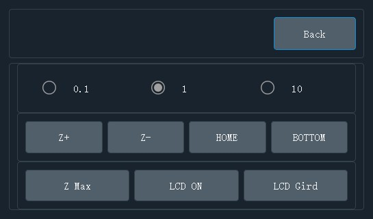
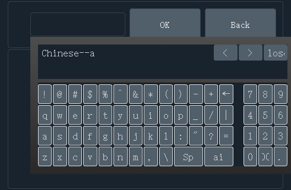

---
# kondor
---
### 1. What't Kondor?
Kondor is an open source LCD (mask)3D printer firmware started by 2 team members of Peopoly. Our goal is to create a flexible firmware that can run on different types of boards and is ideal for experimentation and customization.   
Here are the key features:
-    Drive 2 LCDs via SPI + HDMI for improves performance over UART
-    Easy to get and low-cost BOM 
-    Runs on inexpensive easy to acquire boards like Pi 3B
-    Able to do 4K
-    Core is C++
-    Ability to drive DLP (not at initial launch)

Launch Step:
-    Shared BOM and img for Pi3 for public testing while we clean up the codes for release and take care bugs as needed to it is stable. 
-    Then when the firmware is more stable and cleaned up, we will release codes 

I also want to take this chance to share with you why we started this project: 
We want to give back to the open source community because we learned from projects like Marlin, Cura, and others.
We believe there should be more open source projects launched by Asian developers and we want to do our fair share.

While the project is launched by2 guys from Asia, it belongs to the world. Join us to have some fun printing, testing and push the project forward.

### 2.How to use it?

**Pre-flight  5/12/2019**

The first stage is making sure testers have the Pi 3B and can connect the slicer to the firmware.
please use this Google doc for instructions for now:
https://docs.google.com/document/d/19AATh-Tu5reST9AKc0AZlHu6AHty7qCWfsSJ5gP3phQ/edit?usp=sharing
We will move the descrition to github once we have the firmware more tested out. 

**Todo List 5/14/2019**

Here's some idear we need to do.

- Slicer
    - [ ] translate some chinese to english
    - [ ] record the device ip by default
    - [ ] hide/remove the autosupport temporarily

- Pi Server Controler
    - [x] add auto connect serial port 
    - [x] test the gcode sender in the pi, test z motor and titlt motor
    - [x] report the pi's IP when the software start
    - [ ] fix the virtual keyboard bug

### Kondor Code Refactoring

Kondor was ported from a DLP printer controller code and we found that parts of the codes  is not needed or not practical for LCD printers (especially one with a small 3.5" screen). We have since update the code to reflect user feedback:

- Kondor Slicer - This is for slicing, adding support and simple transfer of the files for printing.
- Kondor Device Manager, This is for managing printers running Kondor. It can be used to discover printers and send files.
- Kondor Pi Image This is the Kondor image for Pi3. This firmware allows Pi3 to control LCD panels and talk to the Slicer and Device Manager.
- Kondor Marlin, This is for 2560 Ramp1.4 board. It is used to control motors and LED

Above are the 4 corner stones for Kondor project.  Below of the basic UI

#### 1. Device Manager

#### 2. Kondor Pi Image

#### 3. Konder Wifi Set

~~In Kondor Pi Image中，We utilize [RaspAP](https://github.com/billz/raspap-webgui) for setting network configuration. Please see the link if you want to learn more.~~

**2019-7-29**
We started testing RaspAP for easy setup but this is still not very stable yet. So instead, we added Wi-Fi setup interface on the firmware to make it easier for users.

**2019-8-12**
实现了PC端的基本控制，以及Pi端的应用程序更新模块，在不用重新刷镜像以及联网的情况下，更新Raspberry Pi上面的应用程序。

#### 4. Kondor Hardware

1. Ramp1.4 Marlin，Motor control，Please use below pin out

