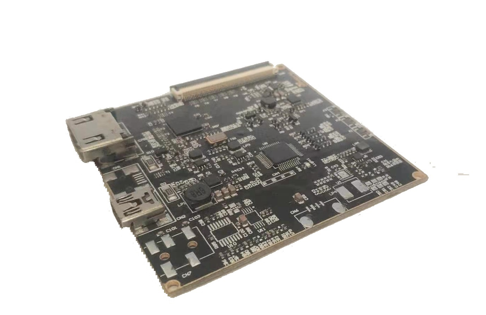
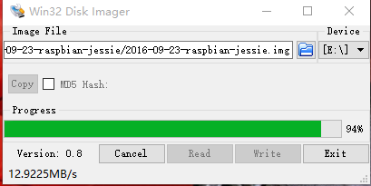
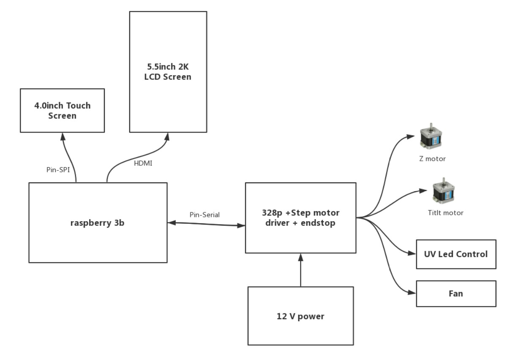

# Kondor User Guide

## 1. Hardware

Hardware list:

- Raspberry Pi 3B
- Raspberry Pi SPI touch screen 
	- 3.5 inch (default support by firmware)
	- (other size possible but need manual change to configuration file)
- Raspberry Pi expansion board (based on 328p)
- LCD Panel with a compatible display driver. Some examples
    - 2k, 5.5 inch (1440*2560) (default support)
    - 2k, 10.1 inch (1600*2560) (need modification to configuration)
- UV LED Array and driver
	- For development purpose, it may be good to use a back lighted panel without UV LED array
- microSD card with a size >= 8GB
	
	
Pictures:

|Hardware Name|Basic Description|Picture|
|:--:|:--:|:--:|
| Raspberry Pi 3B|Basic models||
|3.5 inch Raspberry pie screen | 3.5inch RPi LCD (A)||
|HDMI to MIPI Driver|For LS055T1SX04||
|2k screen|1440x2560, 5.5 inch||

## 2. Firmware

## 2.1 Installing KondorOS 

### 1. Download image and burn tool

1. Windows image burning tool for img file Win32DiskImager

[Download link] (http://nchc.dl.sourceforge.net/project/win32diskimager/Archive/Win32DiskImager-0.9.5-install.exe)

2. System image download address

[Mirror address (to be uploaded)] ()

### 2. Burn image to microSD

After installing the image burning tool, prepare an sd card reader by first run SD card format using SD Formatter to FAT32
https://www.sdcard.org/downloads/formatter/
This ensures proper image burning to correct partition

Then insert the sd card to be burned into the card reader, and insert it into the computer.
After that, operate the win32 Disk Imager tool as shown below.

### 3. Power-on detection

Insert the burned SD card into the Raspberry Pi, plug in the Internet cable and power supply, and you can see the IP address of the Raspberry Pi through the LCD screen.

## 2.2 Software specific operation

### 1. Connecting wifi

### 2. Setting the Z-axis travel

### 3. Get the print file

- network transmission
- USB read

### 4. Update the Raspberry Pi app
To update the program, we need to use our host computer management program. The change tool is used to refresh the Raspberry Pi app and transfer the slice files to be printed over the network.

### 4. Introduction to common control panel

## 3. Developer

### 3.1 Introduction to the framework

Konder's PC client and Pi-side programs are developed based on the Qt/C++ framework. The Raspberry pie uses Python's Flask for http server, Qt/C++ interface and underlying hardware control. Image processing, and printing logic. The communication between the Raspberry Pi and the shield uses serial communication. In KondorOS, the 8th pin of the Raspberry Pi is set as the pin of the serial communication, so that the shield can be directly inserted on the Raspberry Pi. Communicate.

The development of Qt/C++ on the embedded side has natural advantages. In addition to the very good performance interface, it is also very convenient to integrate many drivers directly into the C/C++ project, which provides great convenience. This is an important reason why KonderOS is not fully developed in Python.

With the following figure, we can have a general understanding of the hardware framework of our Pi end:

### 3.2 Kondor Development Category

We need the following contributors:

- Qt/C++ developers
- UI designer
- 328P microcontroller development (firmware based on Grbl)

Our KondorOS development will also focus on the above three aspects, of course, if you are familiar with materials, structures, electronic hardware, or have a good understanding of the use of 3D printers, you can join our development.

### 3.3 Image Packaging Compression Release Script

The packaged compression of the image must be done under Ubuntu 16.04. Using our packaged compression script, one-click copy of the system in the SD card to generate a new image and compress it.

## 4. ToDo List Here