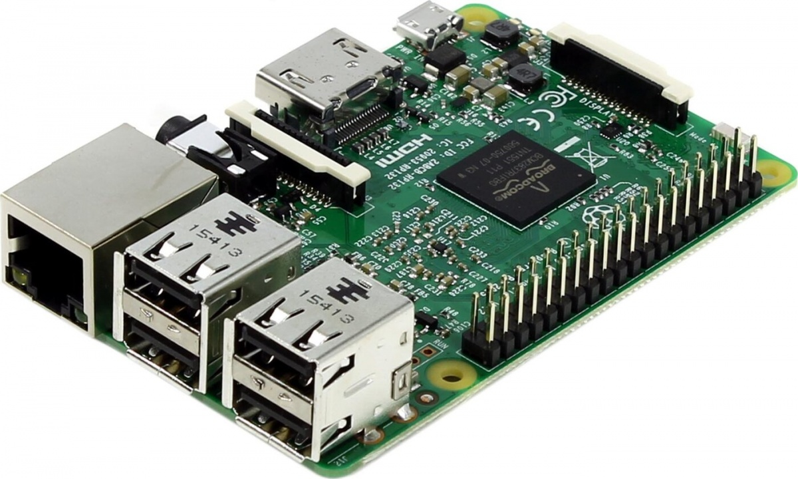
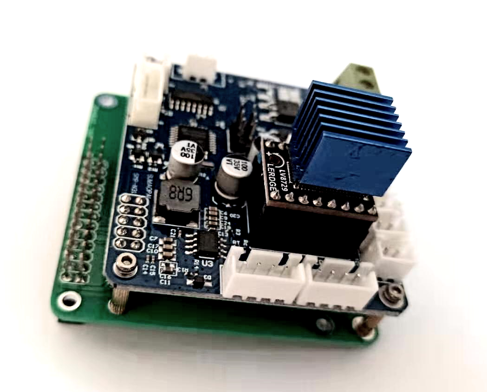
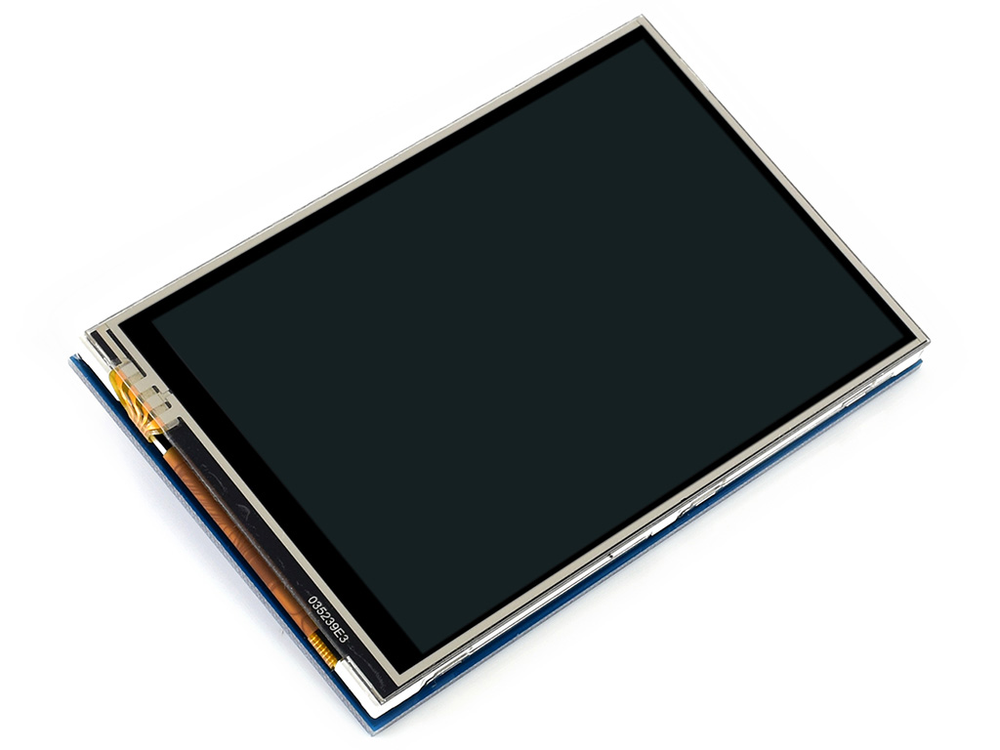
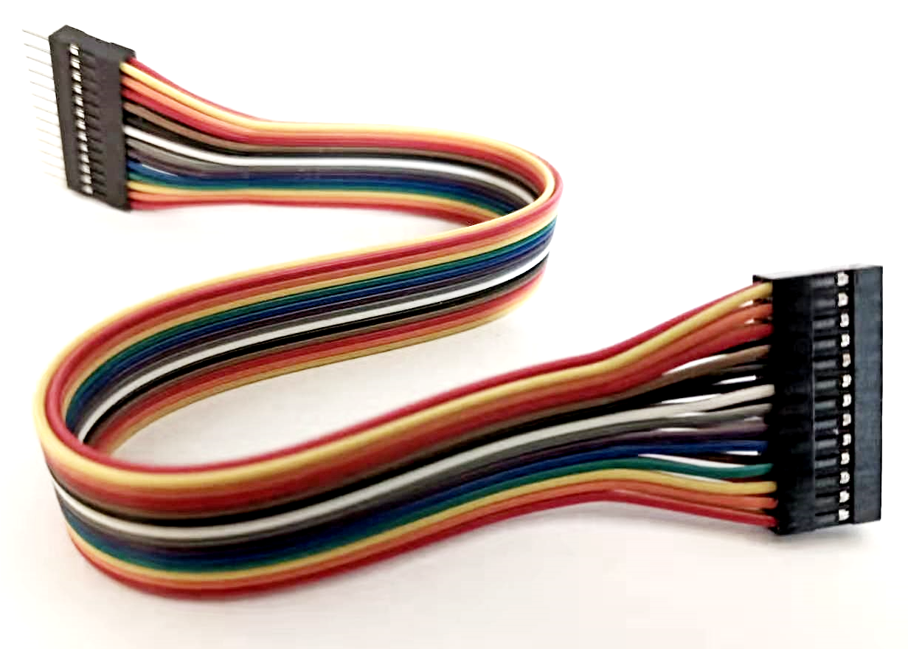
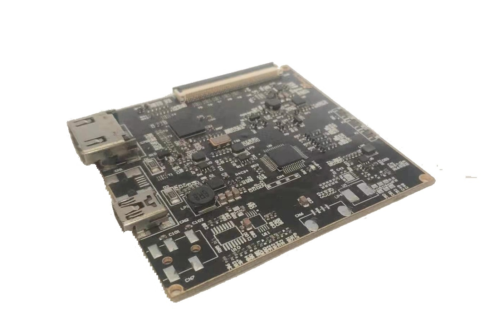
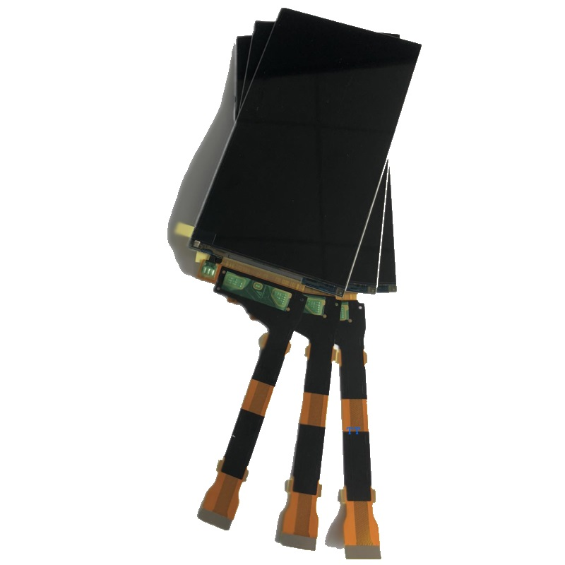
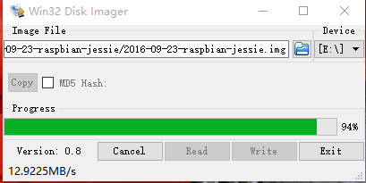
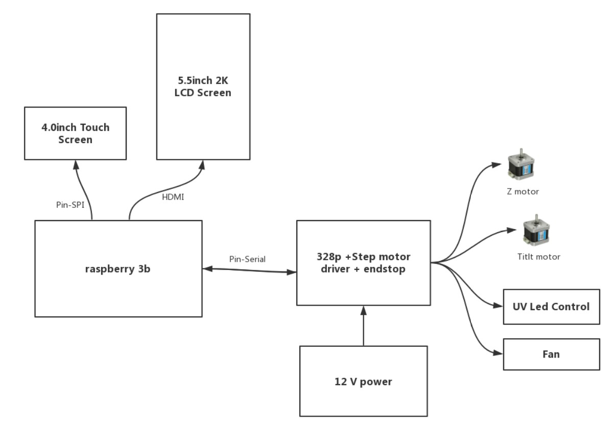

# 用户手册

## 1. 硬件介绍

硬件清单:

- 树莓派3B
- 树莓派 SPI 3.5 inch系统触摸屏
- 树莓派扩展板(基于328p)
- 屏幕以及屏幕驱动
    - 2k,5.5 inch (1440*2560)
    - 2k,10.1 inch(1600*2560)
- UV LED 主板

图片介绍:

|硬件名称|基本描述|图片|
|:--:|:--:|:--:|
|树莓派3b|基础款||
|Kondor扩展板|328p||
|3.5寸树莓派屏|3.5inch RPi LCD (A)||
|3.5寸树莓派屏排线|3.5inch RPi LCD (A)||
|HDMI转MIPI驱动|针对LS055T1SX04||
|2k屏幕|1440x2560, 5.5寸||

## 2. 直接使用者

## 2.1 KondorOS系统使用

### 1. 下载镜像和烧录工具

1. windows镜像烧录工具

[下载链接](http://nchc.dl.sourceforge.net/project/win32diskimager/Archive/Win32DiskImager-0.9.5-install.exe)

2. 系统镜像下载地址

[镜像地址(待上传)]()

### 2. 烧录镜像

安装好烧录镜像烧录工具后，准备好一张sd卡读卡器，将要烧录的sd卡插在读卡器上，插入到电脑。
之后，按照如下图所示，操作win32 Disk Imager工具。

### 3. 上电检测

将烧录好的SD卡插入树莓派，插上网线和电源，通过LCD屏幕，可以产看到树莓派的IP地址。

## 2.2 软件具体操作

> 更具体详情请查看操作[视屏]()

### 1. 连接wifi

### 2. 设置Z轴行程

### 3. 获取打印文件

- 网络传输
- USB读取

### 4. 更新树莓派内应用程序
更新程序，需要使用我们的上位机管理程序(DeviceManager)。该工具用于刷新树莓派的应用程序以及通过网络传输要打印的切片文件。

### 4. 常用控制面板介绍

## 3. 开发者

### 3.1 框架介绍

Konder的PC客户端以及Pi端运行的程序，都是基于Qt/C++ 框架来进行开发的，树莓派端，采用了python的Flask来做http服务器，Qt/C++实现界面以及底层的硬件控制，图片处理，和打印逻辑。 树莓派和shield之间的通信采用的是串口通信，KondorOS中，将树莓派的8号10号引脚设置成了串口直接通信的引脚，这样，shield可以直接插在树莓派上进行通信。 

以Qt/C++在嵌入式端的开发有天然的优势，除了性能非常好的界面之外，还可以很方便的将很多驱动程序直接集成在C/C++工程中，提供了极大的方便。 这是KonderOS没有完全采用python开发的一个重要原因。

同过下图，可以对我们Pi端的硬件框架有一个总体的认识:

### 3.2 Kondor开发分类

我们需要如下的贡献者:

- Qt/C++ 开发人员
- UI设计人员
- 328P 单片机开发(固件基于Grbl)

我们的KondorOS开发也会主要是围绕上述的三个方面来进行，当然，如果您熟悉材料，结构，电子硬件，或者是对使用3D打印机有不错的见解，都可以加入到我们的开发中来。

### 3.3 镜像打包压缩发布脚本

镜像的打包压缩必须在Ubuntu16.04下进行。 使用我们提供的打包压缩脚本，可实现一键将SD卡中的系统拷贝生成新的镜像并且进行压缩。

## 4. ToDo List Here
